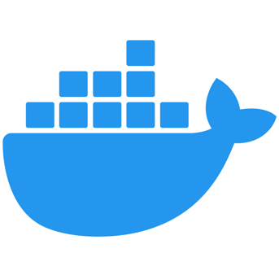

# [](https://docs.docker.com/reference/)

# <p align="center"> </p>

[](https://owasp.org/projects/#sec-flagships)
[](https://github.com/OWASP/Amass/releases/latest)
[](https://hub.docker.com/r/caffix/amass)

**Referencias**

| Technique    | Data Sources |
|:-------------|:-------------|
| [Portainer](https://www.portainer.io/) | [Docker-compose](./portainer-ce) |
| [Amass](https://github.com/owasp-amass/amass) |	|
| [PayloadsAllTheThings](https://github.com/swisskyrepo/PayloadsAllTheThings)|	|
| [Gowitness](https://github.com/sensepost/gowitness) |		|
| [thatonetester-sumrecon](https://github.com/TheJoyOfHacking/thatonetester-sumrecon) |     |
| [nvm](https://github.com/nvm-sh/nvm) |     |
| [-Ethical-H-Resources](https://github.com/TCM-Course-Resources/Practical-Ethical-Hacking-Resources) |     |
| [PEASS-ng](https://github.com/carlospolop/PEASS-ng) |         |
| [pimpmykali)](https://github.com/Dewalt-arch/pimpmykali) |         |
| [Log4jUnifi](https://github.com/puzzlepeaches/Log4jUnifi) |         |
| [httprobe)](https://github.com/tomnomnom/httprobe) |         |
| [php-reverse-shell)](https://github.com/pentestmonkey/php-reverse-shell) |         |
| [xss-payload-list](https://github.com/payloadbox/xss-payload-list) |         |
| [assetfinder](https://github.com/tomnomnom/assetfinder) |         |
| [breach-parse](https://github.com/hmaverickadams/breach-parse) |         |
| [sumrecon)](https://github.com/Gr1mmie/sumrecon) |         |
| [PenDock)](https://github.com/Kr0ff/PenDock) |         |
| [PowerSploit](https://github.com/PowerShellMafia/PowerSploit) |         |
| [pspy](https://github.com/DominicBreuker/pspy) |         |
| [OpenLuck](https://github.com/heltonWernik/OpenLuck) |	|
----
```bash
| [](https://github.com/) |         |
| [](https://github.com/heltonWernik/OpenLuckgit init
```
Emfase  `docker run -v OUTPUT_DIR_PATH:/.config/amass/ caffix/amass enum -share -d example.com`

:stop_sign:   **Please avoid opening GitHub issues for support requests or questions!**

* [Patrik's Amass data source scripts](https://github.com/PatrikFehrenbach/amass-tools)

\- Max Deighton, Accenture Cyber Defense Manager
| [](https://github.com/) |         |
| [](https://github.com/) |         |
| [](https://github.com/) |         |
| [](https://github.com/) |         |
| [](https://github.com/) |         |
| [](https://github.com/) |         |
| [](https://github.com/heltonWernik/OpenLuck
